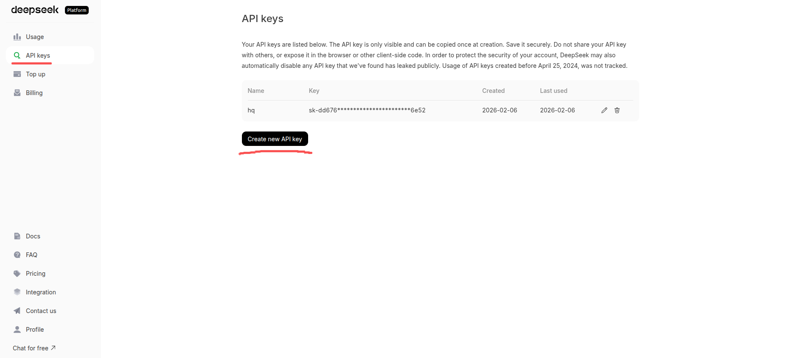
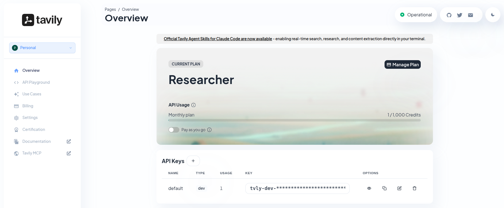
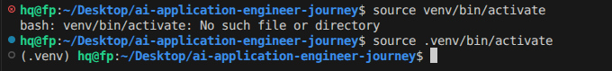
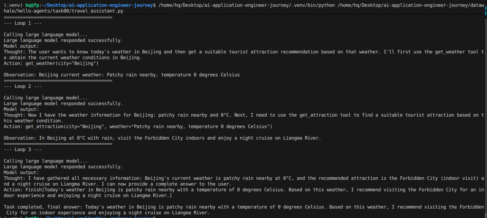

# Hello-agents 


以项目为驱动，逐步了解agents的使用及特性。

## Extra07 - 环境配置

### 一、环境要求

1.1 Python版本

Python 3.10+    （-U Python 3.12.3）

支持的操作系统：Windows、macOS、Linux   （-U Ubuntu 24.04.3 LTS）

1.2 目标代码说明

智能旅行助手功能

天气查询工具（基于 wttr.in API）

景点推荐工具（基于 Tavily Search API）

OpenAI 兼容的 LLM 调用

ReAct 模式的 Agent 执行流程

### 二、API 配置

2.1 选择一个OpenAI 兼容的 LLM 调用，我选择的是教程给的两个推荐平台之外的deepseek平台。

注册： [https://www.deepseek.com/](https://www.deepseek.com/)

创建API：[https://platform.deepseek.com/api_keys](https://platform.deepseek.com/api_keys)

  

需要注意的是API需要直接复制保存，之后无法在这里看到，否则需要创建新的API。  （建议使用教程推荐的免费平台）

2.2 Tavily Search API 配置


[https://app.tavily.com/home](https://app.tavily.com/home)



### 三、Python环境配置

Ubuntu 24.04.3 LTS 自带Python语言，下载vscode编辑器[https://code.visualstudio.com/](https://code.visualstudio.com/)


创建虚拟环境

'''
 进入项目目录
cd "ai-application-engineer-journey"    存放相关学习项目
mkdir datawhale/hello-agents    创建datawhale/hello-agents学习目录

 创建虚拟环境
python -m venv .venv

 Linux:
source venv/bin/activate



安装依赖

```
# 安装核心依赖
pip install requests>=2.31.0
pip install tavily-python>=0.3.0
pip install openai>=1.0.0

# 可选：安装其他常用包
pip install python-dotenv>=1.0.0

```

### 第一个小项目（智能旅游助手）

代码见travel_assistant.py




核心能力： 提取需求，计划功能，功能实现工具。