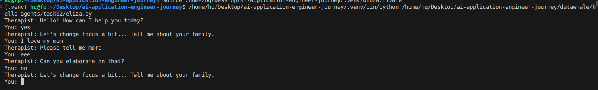

# 第二章学习笔记：智能体发展史

> 学习目标：用历史脉络解释“现代智能体（LLM Agent）为什么长这样”。核心结论：当代 Agent 是三条路线的融合——**符号推理（规则/逻辑）**、**数据驱动学习（神经网络/深度学习）**、**序贯决策（强化学习/规划）**，并通过工程化组件（工具、记忆、反思、评估）形成可落地闭环。

---

## 1. 为什么要学“发展史”

- **理解“架构来源”**：现代 Agent 的“规划—行动—观察—记忆—反思”并非凭空出现，而是对历史阶段反复暴露的问题（规则爆炸、泛化不足、训练成本高、不可控/幻觉等）的总结与工程化回应。
- **把握趋势**：AI 的主流路线总体从“手写规则”逐步转向“数据驱动学习模型”，并在当下通过“模型 + 工具 + 约束”的方式融合两者优势。

---

## 2. 第一阶段：符号主义（Symbolic AI）——规则、逻辑与搜索（约 1950s–1980s）

### 2.1 核心思想
- 智能可由**符号操作**实现：知识表示（Knowledge Representation）+ 逻辑推理（Reasoning）+ 搜索（Search）。
- 典型系统：定理证明、规划系统、规则推理系统。

### 2.2 专家系统（Expert Systems）
- 结构：**规则库（IF-THEN）+ 推理机（Inference Engine）**
- 优点：
  - 可解释：能说清规则可审计、可人工修改
- 局限（也是导致“AI 冬天”的重要原因）：
  - **知识获取瓶颈**：专家知识难抽取、难编码、维护成本高
  - **规则爆炸**：复杂领域规则数量指数级增长，冲突难处理
  - **脆弱性（Brittleness）**：开放世界、噪声输入、边界条件一多就失效
  - 难以学习：系统不会“从经验自动变好”

> 对现代 Agent 的启发：符号主义没有消失，而是以“**约束/校验/工作流守门**”回归，用来增强安全与可靠性。

---

## 3. 第二阶段：早期对话与交互系统——ELIZA 的启示（1960s）

- ELIZA 通过模板与模式匹配模拟心理咨询对话，本质是“**规则驱动的语言表演**”，并不理解语义。
- 启示：
  - “像人一样说话”不等于“真的懂”
  - 语言系统如果缺少可验证行动与外部反馈，很容易产生“看似合理但不可靠”的，必须把语言推理落到“**工具调用/可验证 Observation**”上，形成闭环。

---

## 4. 第三阶段：统计学习与联结主义回归——从“写规则”到“学表示”（约 1980s–2010s）

### 4.1 核心思想
- 用数据学习模型参数，让系统自动获得特征与表示（Representation）。
- 相比符号主义更适合感知类任务（语音、图像、文本分类等）。

### 4.2 优点
- 表达能力强：能从大量数据提取复杂模式
- 适应性更好：无需为每种情况手写规则

### 4.3 局限
- 可解释性弱：难回答“为什么这样判断”
- 数据依赖强：没数据就难提升
- 对长程规划不擅长：能识别但不一定会“做决策”

> 对现代 Agent 的启发：LLM 提供强大的“通用表示+推理”能力，但仍需要外部工具与约束来提升可靠性。

---

## 5. 第四阶段：深度学习 + 强化学习（RL）——从“识别”到“决策”（约 2010s–2022）

### 5.1 强化学习解决的问题
- **序贯决策（Sequential Decision Making）**：当前动作影响未来状态与回报（Return）
- 强调“试错—反馈—策略更新”的闭环

### 5.2 里程碑意义（以 AlphaGo 为代表）
- 体现“规划 + 价值评估 + 搜索”的结合：不仅预测，还会选择行动
- 推动了“可执行策略”的工程化

### 5.3 RL 的现实瓶颈
- 交互成本高：需要大量环境试错
- 迁移泛化难：换环境就得重学
- 安全与可控难：策略探索可能产生高风险行为

> 对现代 Agent 的启发：现代 Agent 借鉴 RL 的“闭环与目标导向”，但用“语言规划 + 工具调用”替代高成本环境交互。

---

## 6. 第五阶段：LLM 驱动的现代智能体（2022–至今）

### 6.1 为什么 LLM 让 Agent 变得可用
- LLM 带来三项关键能力：
  1) **自然语言理解与生成**（交互接口统一）  
  2) **跨领域知识**（通用“世界模型”雏形）  
  3) **任务分解与推理**（能把复杂任务拆成子任务）

### 6.2 现代 Agent 的典型工程组件
- **Observation（观察）**：用户输入、工具返回、环境状态
- **Planning（规划）**：任务分解、步骤设计、策略选择
- **Action（行动）**：调用工具（搜索/数据库/代码/外部 API）
- **Memory（记忆）**：短期上下文 + 长期偏好/知识（RAG/向量库）
- **Reflection（反思）**：失败复盘与策略调整（提升鲁棒性）

### 6.3 现代 Agent 仍然困难的点
- 幻觉：缺证据仍编造
- 工具鲁棒性：参数错误、API 失败、超时与限流
- 循环失控：反复尝试、成本爆炸
- 评估困难：准确线的融合：一张“能力拼图”表

| 路线 | 主要贡献 | 典型优势 | 典型短板 | 现代 Agent 对应形态 |
|---|---|---|---|---|
| 符号主义 | 规则、逻辑、可控推理 | 可解释、可审计 | 规则爆炸、脆弱 | 约束/校验器、工作流守门、结构化输出 |
| 深度学习 | 表征学习 | 模式识别强 | 难解释、易偏差 | LLM 作为“大脑”做理解与生成 |
| 强化学习/规划 | 序贯决策闭环 | 目标导向、会行动 | 训练成本高、泛化难 | 多轮迭代、反思、策略更新、工具反馈闭环 |

---

## 8. 本章“写代码时最有用”的结论
1. 工具与可验证反馈。
2. **只用工作流（Workflow）≈ 稳但死板**；遇到开放问题缺乏灵活性。
3. 现代方案倾向 **Workflow + Agent 混合**：  
   - 关键路径用规则守住（合规/风险）  
   - 复杂开放部分交给 Agent 做推理与工具编排

---

---

## 9. 实践

## 10. 学习心得
本章梳理智能体从符号规则、统计学习、强化学习到 LLM Agent 的演进，理解现代架构为何需要工具、记忆、反思与闭环评估。

